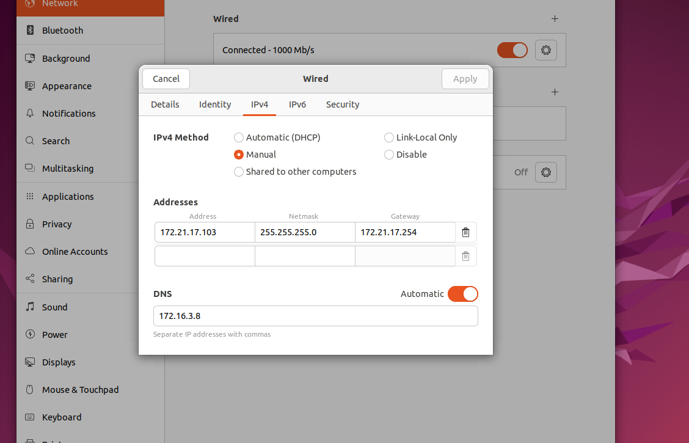
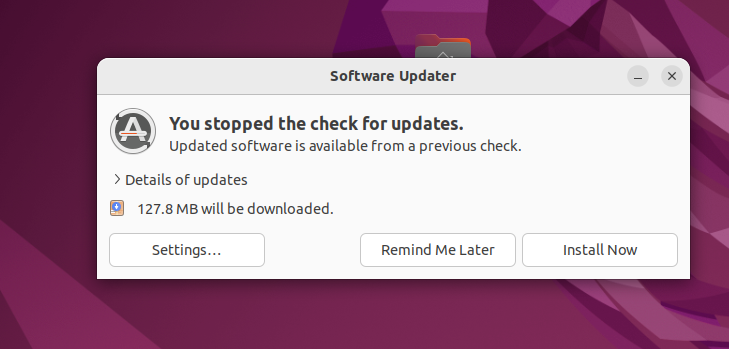
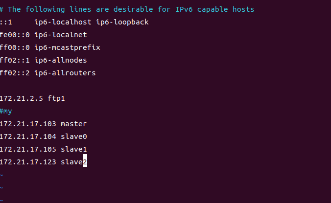
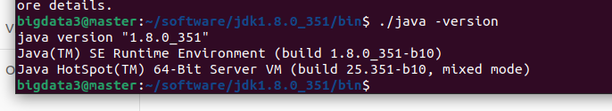
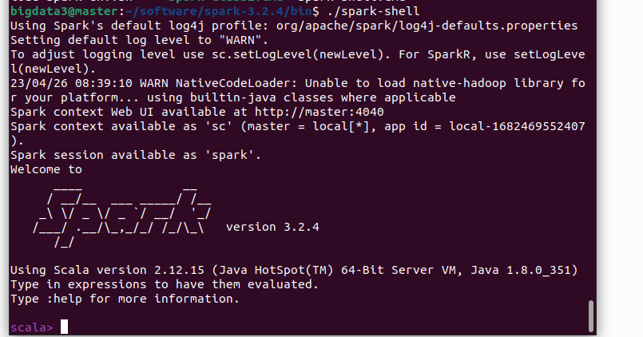
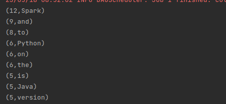
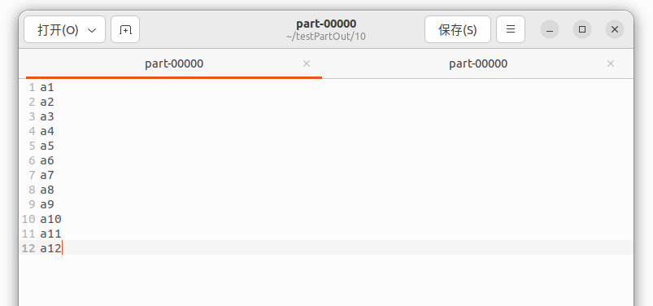
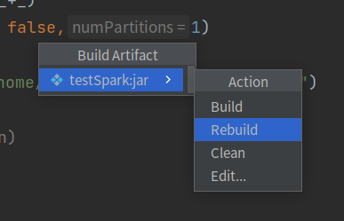
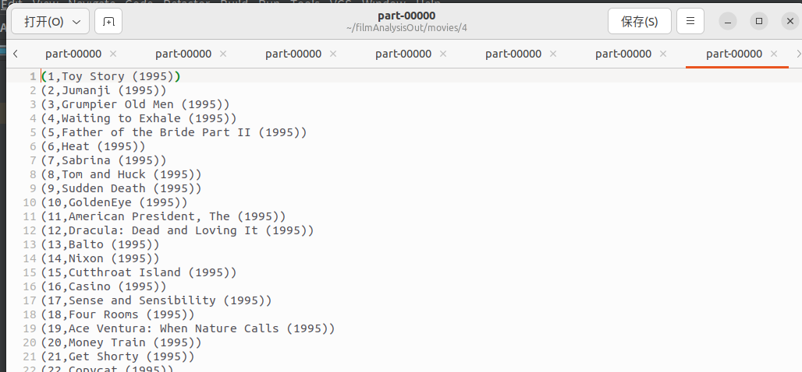
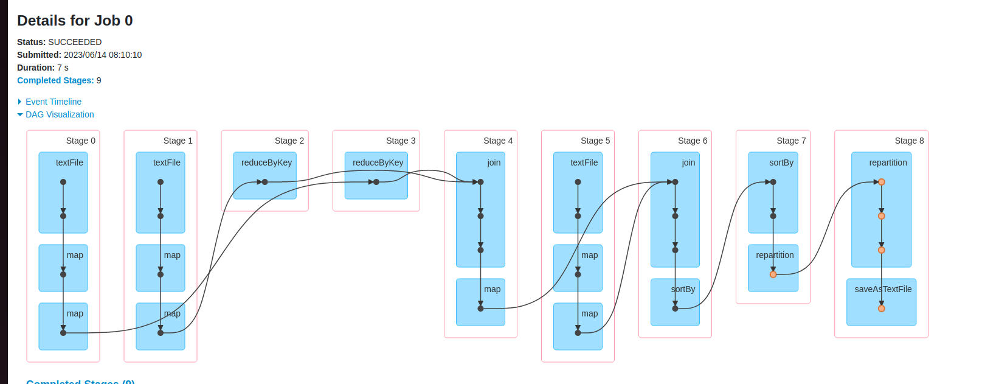

# 手把手大数据——从系统搭建讲起 
本文将从系统环境搭建开始，分别对Hadoop集群的配置，Scala语言，spark编程进行说明，并对可能出现的问题以及本人在搭建过程中产生的一些疑问进行解答。最后，将通过一个电影评分实例来熟悉所学的知识。
本文编写采用Markdown语法，推荐安装插件：Markdown All in One，Markdwon Preview Enhanced，Markdown Image 后进行阅读。

* [一、系统环境搭建](#1)
* [二、系统搭建](#2)
	* [2.1 配置java](#2.1)
* [三、Hadoop集群配置与启动](#3)
	* [3.1 集群配置的准备](#3.1)
	* [3.2 ssh免密设置](#3.2)
	* [3.3 所有节点都关闭安全策略](#3.3)
	* [3.4 集群配置文件](#3.4)
	* [3.5 配置文件分发](#3.5)
	* [3.6 使用脚本分发](#3.6)
	* [3.7 hdfs命令](#3.7)
	* [3.8 运行MapReduce程序](#3.8)
	* [3.9 hdfs](#3.9)
	* [3.10 Hadoop集群的伸缩](#3.10)
* [四、scala语言及环境启动](#4)
	* [4.1 Scala原生环境](#4.1)
	* [4.2 scala集成开发环境](#4.2)
	* [4.3 scala语言入门](#4.3)
	* [4.4 scala语言的函数式编程](#4.4)
* [五、spark编程](#5)
	* [5.1 启动spark的scala环境](#5.1)
	* [5.2 RDD相关概念](#5.2)
	* [5.3 spark程序运行模式](#5.3)
	* [5.4 spark集成开发环境的使用（idea）](#5.4)
	* [5.5 RDD编程](#5.5)
	* [5.6 RDD操作](#5.6)
	* [5.7 分区](#5.7)
	* [5.8 生成jar包送到集群运行](#5.8)
* [六、电影数据实例分析](#6)
	* [6.1 数据集的数据格式](#6.1)
	* [6.2 找出评分排名前十的电影名](#6.2)
* [七、后记](#7)


## 一、系统环境搭建 <a id ="1"></a>
### 1.1 操作系统：Linux 
所选用的操作系统为 Linux
选择Ubuntu发行版22.04.2LTS
官网下载地址：https://ubuntu.com/download/desktop
下载建议：不要选择最新版的，不一定稳定。

>Q：为什么选择Ubuntu
A：开源、不收费。


### 1.2 在virtualBox中打开Linux 
#### 1.2.1 打开virtualBox
右键-以管理员身份运行
#### 1.2.2 创建虚拟机
主页面-新建 类型：Linux 版本Ubuntu-64bit
  
！！注意 这一步要选动态分配
  
因为这样对磁盘空间的利用率比较高，但启动前要检查磁盘剩余空间大小，太小容易宕机（（
建议虚拟磁盘大小>=60G

### 1.3 设置虚拟机硬件
主界面-设置
系统：CPU核心数>=2 内存>=4G（这里我分别选择了3 8G）
网络：台式机选择桥接网卡
光驱：选择下载的光驱
### 1.4 启动
按照提示进行操作即可

### 1.5 在VirtualBox中打开虚拟机映像
在主页面点击注册，按提示打开之前配置好的文件（好像直接从之前的文件夹里直接进去也可以）
#### 1.5.1 启动前配置
* 查看CPU 内存 
* 网络设置：连接方式：桥接（当然如果是笔记本的话网络地址转换也没啥问题）
*  MAC地址（！！！每次最好刷新一下… 因为如果mac地址相同是一件很麻烦的事情…可能就上不了网了）

### 1.6 配置Linux
#### 1.6.1 连接网络
左上角点击这个图标
  
按照下面内容进行设置（这里的.103是我自己用的）
  

总之就是按照网管给你的ip地址和网络进行配置就可以。配置好之后记得上一下网看看网络是不是能正常使用了。

#### 1.6.2 安装虚拟机增强功能
目的是为了虚拟机显示的尺寸能够自适应，并且与宿主机的粘贴板、文件夹共享。
**tips：在Linux中，没有扩展名的概念，一般.sh结尾的文件就是可执行文件。在今后，我们会遇到很多次这种情况。**

**操作步骤如下：**
点击菜单栏 “设备”->“安装增强功能”
这时候会发现虚拟机页面上会多一个光盘的图标，点击打开；
会发现里面有一个autorun.sh文件，运用这个文件进行安装，但是这个文件打开是类似.txt的文本文件不能直接运行，我们应该打开一个终端（terminal），在终端中执行 ./autorun.sh。
最后根据提示，回车退出窗口后重启虚拟机即可
（好像会跳出一个对话框问你是否要restart，选择restart即可）

重启完成后，点击菜单栏中的自动调整显示尺寸即可。同时，设置共享粘贴板等（双向）。

#### 1.6.3 配置软件更新
点击左下角
  
  
 1](images/099962ce785afcca66375109ff0b1da5ce53a3dfa00fd9910b8509ac9257d998.png)  
如果显示“checking for updates”，点击“stop”，然后就会跳出下面这个对话框：
  
点击“settings”
  
在这里对下载源进行选择，杭州一般选aliyun或huaweiCloud。其他地区自己选一个比较快的就行。然后直接close所有出现的窗口
进行软件源初始化：在终端执行：sudo apt-get update
如果要全部更新，在终端执行：sudo apt-get upgrade
#### 1.6.3 ssh服务安装
ssh是采用非对称秘钥的远程登录工具.
在之后配置好集群后。我们可以采用这种方式登录其他节点：
ssh slave0
但是在没有进行免密设置的情况下，需要每次都输入密码。所以在之后我们会进行ssh免密设置，更加方便。[点击跳转阅读3.2 ssh免密设置](#ssh)
ssh服务包括两个：client，server
默认安装好了client，现在安装server：sudo apt install openssh-server
#### 1.6.4 vim安装与使用
安装:sudo apt install vim
vim有三种模式：命令模式 编辑模式 底行命令模式
三种模式的切换：
刚进入时是命令模式，按i进入编辑模式，按Esc回到命令模式
在命令模式下，按":"进入底行命令模式，按Esc回到命令模式

### 1.7 系统设置 <a id ="host"></a>
#### 1.7.1 修改计算机名 
计算机名在 /etc/hostname
编辑hostname：sudo vim /etc/hostname 

将文件内容改成想要的计算机名 master/slave0/slave1
这样在之后远程登录的时候就可以直接写 ssh master之类的，就很方便
#### 1.7.2 配置域名解析文件
域名解析文件：/etc/hosts
命令：sudo vim /etc/hosts
>加sudo是因为修改计算机名需要高级权限，不加会出现这种错误：

  

出现如下界面：
  
#### 1.7.3 软件版本选择
从spark->Hadoop->Java顺序选择
从spark.apache.org看：
  
下载二进制包，所以spark选择稳定版3.2.3，Hadoop选择3.2.
从apache.hadoop看：
java版本选择：
  
java选择1.8.0_315

## 二、配置Hadoop单机版（StandAlone） <a id ="2"></a>
软件安装方式：（1）系统安装；（2）下载，配置路径
我们使用第二种方式，优点是对系统没有影响，其他用户不可见，缺点是其他用户不可见
### 2.1 配置java <a id ="2.1"></a>
**下载并解压缩java:**
解压缩命令：tar -zxvf 文件名（tar -zxvf jdk-8u351-linux-x64.tar.gz ）
验证软件：
  

### 2.1.1 配置java环境变量

>配置JAVA_HOME：<a id ="homePath"></a>
配置原因：
有一些基于 Java 开发的工具会用到JDK的路径，所以我们配置JDK的路径给JAVA_HOME。

>配置CLASSPATH：
配置原因：
CLASSPATH顾名思义为包路径，告诉Java在执行的时候，去哪里找到需要的包和类供程序使用。所以配置时应把包的路径赋值给CLASSPATH。
（以上解释来源：https://zhuanlan.zhihu.com/p/153500777）

路径位置在文件.bashrc中。
编辑.bashrc：vim .bashrc，添加
``` shell
export JAVA_HOME=~/software/jdk1.8.0_351
export PATH=$JAVA_HOME/bin:$PATH
```
  
新打开一个终端验证：
  
出现上图即可认为配置成功

### 2.1.2 配置Hadoop
**下载并解压缩:**
tar -zxvf hadoop-3.2.2.tar.gz 
验证：
找到Hadoop命令，执行：./hadoop
  
出现上图即可认为配置成功
和之前的道理一样，我们也需要配置有关的环境变量。

配置路径：
编辑.bashrc：vim .bashrc，添加：
``` shell
export HADOOP_HOME=~/software/hadoop-3.2.2
export PATH=$HADOOP_HOME/sbin:$PATH
```
验证：
  

配置 HADOOP-env.sh：vim hadoop-env.sh
  

在最后添加
``` shell
export JAVA_HOME=~/software/jdk1.8.0_351
```

>其实在这配置的时候我一直有个问题，就是我们明明前不久刚配置过JAVA_HOME，为什么还要在hadoop-env.sh中再次配置？为什么系统默认的JAVA_HOME读不到？查阅了很多资料终于找到一个合理的解释：“hadoop执行启动脚本时候会加载这个hadoop-env.sh，如果这里面配置了JAVA_HOME会覆盖/etc/profile里面的$JAVA_HOME 先启动NameNode，然后再通过ssh启动slaves（也就是DataNode、NodeManager这些） ssh过去的时候如果配在/etc/profile，每次都得source一下~ 所以，Hadoop放在hadoop-env.sh里面，这样的话ssh远程执行的时候也不用source /etc/profile了。”
此外，借助Hadoop-env.sh文件中的原文注释 Set Hadoop-specific environment variables here. The only required environment variable is JAVA_HOME. All others are optional. When running a distributed configuration it is best toset JAVA_HOME in this file, so that it is correctly defined onremote nodes. 翻译过来大概是： 在这里设置特定于hadoop的环境变量。 唯一需要的环境变量是JAVA_HOME。其他都是可选的。在运行分布式配置时，最好在这个文件中设置JAVA_HOME，以便在远程节点上正确地定义它。
总结一下就是远程登录时的环境变量的问题。
（以上解释来源：https://bbs.csdn.net/topics/398691342 及 hadoop-env.sh官方注释）

### 2.1.3 运行Hadoop-example
运行grep：查找目录下所有文件中符合条件的内容
建立输入目录，并将要查找的文件放入目录中
```shell
mkdir testHadoopExample #在家目录下新建一个测试目录
cd testHadoopExample
mkdir input1
cp $HADOOP_HOME/etc/hadoop/*.xml input1 #拷贝文件到input1目录下
hadoop jar $HADOOP_HOME/share/hadoop/mapreduce/hadoop-mapreduce-examples-3.2.2.jar grep 
input1 output 'dfs[a-z.]+' #运行例程
cd output
cat part-r-00000 
```
  
  
  
  


## 三、Hadoop集群配置与启动 <a id ="3"></a>
完成单机版的配置后，同样的，我们就能很快完成其他节点的配置，从而为搭建集群做好准备。
### 3.1 集群配置的准备 <a id ="3.1"></a>
#### 3.1.1 已经能够在单机模式下运行
在所有节点上都有Hadoop软件及配置，都能够在单机模式下运行
#### 3.1.2 节点准备
准备三个Linux节点，节点之间网络通讯正常，ssh相互登录正常
>ssh连接命令格式：ssh 用户名@ip地址
连接方式：linux、mac可以直接连接，windows可以用wsl或第三方ssh工具。

所用的三个Linux用户名要相同
修改主机名：master slave0 slave1
配置所有节点的域名hosts
(注意，每个节点上都要配置！(踩过坑的本人狠狠落泪))
比如我的hosts：
  
>这一步不会的移步：[点击跳转阅读 1.7 系统设置](#host)

>这里补充一下 NameNode DataNode：
NameNode节点：存储所有hdfs文件的名字、属性、存储位置、校验值等。一般用master节点
SecondaryNameNode：第二NameNode，跟NameNode同时运行，但不与NameNode完全同步，可能差一个心跳
DataNode节点：存储文件内容（可能多份 分块   一般用slave节点

### 3.2 ssh免密设置 <a id ="3.2"></a>
#### 3.2.1 检查ssh连通性 <a id ="ssh"></a>
从master节点开始对master slave0 slave 
**分别执行**
ssh master 
ssh slave0 
ssh slave1
>（又是一个分别执行！！此时又需要大家在多台电脑间移动了…但是没关系…再过一会学完下一节就不会这么痛苦了…） 

如果连通不了，一般是这两种情况：
* 网络不通，这就没啥好说的了只能乖乖回去检查网络配置= =
* 软件没有安装，使用如下命令安装：
&emsp;&emsp;sudo apt install openssh-client
&emsp;&emsp;sudo apt install openssh-server

#### 3.2.2 ssh 免密设置
过程：
生成密钥对
传送公钥到其他节点

从master开始：
生成密钥对，命令：ssh-keygen -t rsa 
一路回车到底 如果提示覆盖，选择yes
传送公钥到其他节点，命令为：
ssh-copy-id master
ssh-copy-id slave0 
ssh-copy-id slave1

**注意，这里也需要每个节点分别执行生成传送操作，且密钥对需要传送给自己！**

验证，从master开始，分别执行：
ssh master 
ssh slave0 
ssh slave1 
都不需要密码。

如果你某一步不小心出了问题，但是又不知道怎么解决…那就移除密钥后再来一次：
移除密钥： rm -r .ssh
然后再按照上面的步骤再来一次就可以。

（恭喜大家！操作到这里之后总算不用再在多台电脑直接来回跳跃了！！直接ssh就可以免密登录其他电脑了~）

### 3.3 所有节点都关闭安全策略 <a id ="3.3"></a>
Linux一般有防火墙，selinux
Ubuntu22.04的desktop版本防火墙默认没有打开，selinux没有安装
验证防火墙状态：sudo ufw status
  

### 3.4 集群配置文件 <a id ="3.4"></a>
去hadoop官网上查看官方文档，我们得知：
默认配置文件（只读）：core-default.xml, hdfs-default.xml, yarn-default.xml and mapred-default.xml.
需要配置的文件：core-site.xml, hdfs-site.xml, yarn-site.xml and mapred-site.xml.
在配置文件中配置的选项将覆盖默认配置文件中的对应选项
默认Hadoop on yarn
#### 3.4.1 core-site.xml
在core-default.xml中的设置值是<value>file:///</value>  指向本地系统文件的根目录，
由于我们当前要使用hdfs文件系统，所以改为：
``` xml
<property>
  <name>fs.defaultFS</name>
  <value>hdfs://master:9000</value>
</property>
```
表达的是：默认文件系统协议是hdfs://，根目录节点是master:9000

为了提高大文件的读取速度将io.file.buffer.size设置为128k
```xml
<property>
  <name>io.file.buffer.size</name>
  <value>131072</value>
</property>
```
配置完成后：
  

#### 3.4.2 hdfs-site.xml
查看
  
存储位置中有${hadoop.tmp.dir}
hadoop.tmp.dir在core-site.xml有设置 值为 
  

由于不在家目录下，有可能存在读取文件问题，所以在core-site.xml中重新设置
```xml
<property>
  <name>hadoop.tmp.dir</name>
  <value>/home/bigdata3/hadooptmpdir</value>
</property>
```
设置完成后，为
  

结果：hdfs-site.xml没有添加设置

#### 3.4.3 yarn-site.xml

yarn.resourcemanager.hostname
yarn.nodemanager.log-dirs
yarn.nodemanager.remote-app-log-dir
yarn.nodemanager.aux-services

设置为
```xml
<configuration>

  <property>
    <description>The hostname of the RM.</description>
    <name>yarn.resourcemanager.hostname</name>
    <value>master</value>
  </property>    
   <property>
    <name>yarn.nodemanager.log-dirs</name>
    <value>/home/bigdata3/hadooptmpdir/logs/userlogs</value>
  </property>
<property>
    <description>Where to aggregate logs to.</description>
    <name>yarn.nodemanager.remote-app-log-dir</name>
    <value>/home/bigdata3/hadooptmpdir/logs/logs</value>
  </property>
  <property>
    <description>A comma separated list of services where service name should only
      contain a-zA-Z0-9_ and can not start with numbers</description>
    <name>yarn.nodemanager.aux-services</name>
    <value>mapreduce_shuffle</value>
    <!--<value>mapreduce_shuffle</value>-->
  </property>
</configuration>
```
  

#### 3.4.4 mapred-site.xml
```xml
<property>
  <name>mapreduce.framework.name</name>
  <value>yarn</value>
</property>
<property>
  <name>yarn.app.mapreduce.am.staging-dir</name>
  <value>//home/bigdata3/hadooptmpdir/hadoop-yarn/staging</value>
</property>

```
  

#### 3.4.5 workers 
workers文件中写入所有的DataNode节点域名（slave0 slave1） 一行一个
  

（先从software/hadoop-3.2.2/etc/hadoop中将workers拷贝到之前的hadoopconfigTmp/hadoop中）

#### 3.4.6 文件夹的处理
在hadoop-env.sh中将需要的文件夹修改位置为：
``` shell
export HADOOP_PID_DIR=/home/bigdata3/hadooptmpdir/HADOOP_PID_DIR
export HADOOP_LOG_DIR=/home/bigdata3/hadooptmpdir/HADOOP_LOG_DIR
```
（同样也要把文件先拷贝过去）
  

### 3.5 配置文件分发 <a id ="3.5"></a>
当前目录在配置文件编辑目录下：/home/bigdata3/hadoopConfigTmp/hadoop
本地配置文件应该所在位置：/home/bigdata3/software/hadoop-3.2.2/etc/hadoop

>(什么意思呢…就是当时为了防止乱修改导致原来的都崩了，于是把原始文件copy到了一个新文件夹底下先改改看看，现在ok了当然要返回修改原始文件)

远程配置文件目录应该与主机相同。
A) 如果远程机器已经有了相应的软件包（Java Hadoop）

&emsp;&emsp;本地分发：
&emsp;&emsp;cp * /home/bigdata3/software/hadoop-3.2.2/etc/hadoop

&emsp;&emsp;远程分发：
&emsp;&emsp;scp * slave0:/home/bigdata3/software/hadoop-3.2.2/etc/hadoop
&emsp;&emsp;scp * slave1:/home/bigdata3/software/hadoop-3.2.2/etc/hadoop

  

&emsp;&emsp;系统文件分发：
&emsp;&emsp;回到主机的家目录下，分发.bashrc
&emsp;&emsp;scp .bashrc slave0:~
&emsp;&emsp;scp .bashrc slace1:~

  


B) 如果远程机器没有相应的软件包（Java Hadoop）

&emsp;&emsp;本地分发：
&emsp;&emsp;cp * /home/bigdata3/software/hadoop-3.2.2/etc/hadoop

&emsp;&emsp;远程分发：回到家目录
&emsp;&emsp;scp -r software slave0:~
&emsp;&emsp;scp -r software slave1:~

&emsp;&emsp;系统文件分发：
&emsp;&emsp;回到主机的家目录下，分发.bashrc
&emsp;&emsp;scp .bashrc slave0:~
&emsp;&emsp;scp .bashrc slave1:~

### 3.6 使用脚本分发 <a id ="3.6"></a>
>我们在搭建Hadoop完全分布式集群的过程中，要修改很多配置文件或者是安装很多软件，在这个过程中，如果集群数量很大，我们不能把每个节点都编辑一遍，这样既费时又容易出错。因此只要在一个节点编辑好，再通过分发脚本发送给其他节点就可以了。

把上面的内容整合成一个可执行文件，每次调用时只需要调用这个文件即可实现分发。
#### 3.6.1 集群的启动
##### NameNode格式化 
配置好以后，第一次启动集群之前，需要进行hdfs格式化，格式化只在NameNode上。（只要格式化一次！！）
hdfs namenode -format
注意：
* 如果原来hdfs系统有数据，格式化将会破坏数据
* 如果原来hdfs系统有数据，格式化后，启动集群将进入安全模式。所以在格式化之前要删除数据：删除所有节点上的数据文件夹
  

如果不小心进入了安全模式，那么在安全模式下输入指令：
hadoop dfsadmin -safemode leave
即可退出安全模式。

#### 3.6.2 启动集群与关闭集群
使用脚本启动：start-all.sh
使用脚本停止：stop-all.sh
按照当前配置，启动停止都应该在master节点上。

启动后检查：
（1）用jps
按照当前配置，NameNode上
  
datanode上：
  

（2）用web页面
地址：master：9870
  


（3）上传文件测试
命令格式 hadoop f -put 文件名 hdfs路径
例如：传test.txt到hdfs根目录
hadoop fs -put test.txt/

  

上述都没问题的话，就说明集群启动成功了。

#### 3.6.3 配置文件分发脚本制作
Windows下可执行文件有.exe .bat .cmd
Linux下没有具体的可执行文件的规定，所有文件都可以是可执行文件，只要赋予可执行权限
##### 可执行文件的建立
* 文件内容要是shell可以解释的命令
* 执行时要全路径执行，或者在系统变量PATH里添加路径
* 要有可执行权限，如果没有可执行权限，可以将文件作为参数传给bash执行
* 赋给可执行权限用chmod命令，形式： chmod +x 文件名
（要是chmod+x还是提示你没权限的话…那就chmod 777赋予所有权限）

新建一个transConfig文件测试，文件中内容为：echo hello。（运行结果为打印hello）
利用上述两种方式分别执行：
  

  
说明没问题，下面开始编写正式的分发脚本。
放在myShellScripts文件夹下,一般固定路径
在.bashrc文件中新添加PATH，这样系统才知道有这个。
```shell
export PATH=/home/bigdata3/myShellScript:$PATH
```
添加文件内容为：
```shell
#echo hello
configPath=/home/bigdata3/hadoopConfigTmp/hadoop
hadoopConfigPath=/home/bigdata3/software/hadoop-3.2.2/etc/hadoop
cp $configPath/* $hadoopConfigPath
scp $configPath/* slave0:$hadoopConfigPath
scp $configPath/* slave1:$hadoopConfigPath
scp ~/.bashrc slave0:~
scp ~/.bashrc slace1:~
```
执行：
  

最后，重启集群使配置生效。

### 3.7 hdfs命令 <a id ="3.7"></a>
#### 1）创建目录 
hadoop fs -mkdir /路径/目录名
#### 2）拷贝文件到hdfs 
##### （1）从本地文件拷贝到hdfs，如果确定要覆盖同名文件，加参数-f。
hadoop fs -put 本地源文件 hdfs路径/文件名（如果不写文件名则使用原来的文件名）
（从本地文件找）
hadoop fs -put 与 hadoop fs -copyFromLocal相同

##### （2）从hdfs拷贝到hdfs，如果确定要覆盖同名文件，加参数-f。 
hadoop fs -cp /路径/源文件 /路径/目标文件      
（默认源文件从hdfs上找，比如）
  
上图这样写 会提示找不到 这是因为hdfs上没上传
执行下面命令
  
成功后，在web页面也可以看到
  

#### 3）从hdfs拷贝到本地 
hadoop fs -get hdfs路径/文件名 本地路径/文件名 （如果不写文件名，则默认使用原来的文件名）
copyToLocal与get相同。
#### 4）直接显示hdfs上的文件内容 
hadoop fs -cat hdfs路径/文件名
  
#### 5）显示hdfs对应目录下的内容 
hadoop fs -ls hdfs路径
#### 6）移动文件 
-moveFromLocal，-moveToLocal，用法同-put和-get
-mv用法同-cp
#### 7）删除文件 
hadoop fs -rm hdfs路径/文件名
#### 8）删除目录 
##### （1）删除空目录 
hadoop fs -rmdir hdfs路径/目录名
注意 只能删除空文件夹。优点：安全性好 缺点：比较麻烦
  
##### （2）删除非空目录 
hadoop fs -rm -r|-R hdfs路径/目录名
  

  
#### 9）在hdfs上新建一个文件 
hadoop fs -touch hdfs路径/文件名
例如
hadoop fs -touch /hdfs_a.txt
  
#### 10）向hdfs文件写入内容 
hadoop fs -appendToFile 本地源文件 hdfs路径/文件名
  


### 3.8 运行MapReduce程序 <a id ="3.8"></a>
>通过3.6中的操作，我们只能确定hdfs没有问题，即文件存储没有问题，但是计算是否存在问题无法确定。因此，需要执行程序，看看计算是否有问题。如果有，则需要进行修改。

运行程序为：
运行hadoop-mapreduce-examples-3.2.2.jar grep。

##### （1）在hdfs上创建input目录 
&emsp;&emsp;hadoop fs -mkdir /input
##### （2）上传input操作文件到/input目录 
&emsp;&emsp;hadoop fs -put $HADOOP_HOME/etc/hadoop/*.xml /input
##### （3） 程序执行 
&emsp;&emsp;hadoop jar $HADOOP_HOME/share/hadoop/mapreduce/hadoop-mapreduce-examples-3.2.2.jar grep /input /output 'dfs[a-z.]+'

>为什么加了/就表示分布式文件系统了呢？因为hadoop中执行的时候，会查看配置。在配置core-site的时候已经默认文件系统为master:9000,也就是分布式文件系统的命令节点。

执行会出错，按提示修改配置mapred-site.xml
新增内容
```xml
<property>
<name>mapreduce.map.env</name>
<value>HADOOP MAPRED HOME=${HADOOP HOME}</value>
</property>
<property>
<name>mapreduce.reduce.env</name>
<value>HADOOP MAPRED HOME=${HADOOP HOME}</value
</property>
```
 分发配置，执行 transConfig.sh
 然后再次执行hadoop jar $HADOOP_HOME/share/hadoop/mapreduce/hadoop-mapreduce-examples-3.2.2.jar grep /input /output 'dfs[a-z.]+'

 成功的话应该长这样
   
##### （4）查看执行结果 
&emsp;&emsp;hadoopfs -cat /output/part-r-00000
  

### 3.9 hdfs <a id ="3.9"></a>
#### 3.9.1 replication
replication：指文件的副本数，就是同样的文件存了几份
replication通过hdfs-site.xml进行配置,默认是3，在hdfs-default.xml中
```xml
<property>
  <name>dfs.replication</name>
  <value>3</value>
  <description>Default block replication. 
  The actual number of replications can be specified when the file is created.
  The default is used if replication is not specified in create time.
  </description>
</property>
```

但是，实际副本数与节点数有关。如果副本数设置>slave的节点数，则实际副本数是slave的节点数。

#### 3.9.2 文件存储路径
在hdfs的web页面上，查看id和节点位置：
  
文件存储的根路径是我们在core-site.xml中设置的
  
查找到相应的Block Pool路径
  
在 Block Pool中找到blk_1073741857
  
查看文件内容
  

在slave0上也进行同样的做法，发现是一样的：
  

#### 3.9.3 hdfs的BlockSize
块大小。在大数据背景下，文件都非常大，为了提高处理速度，所以块大小（默认是128M）远大于本地文件的块大小（一般默认是4K）
大数据的文件一般都采用追加方式，key：value
修改通过hdfs-site.xml 的配置，默认配置是128M，在hdfs-default.xml中，修改为64M
```xml
<property>
  <name>dfs.blocksize</name>
  <value>67108864</value>
</property>
```
上传一个大于64M的文件，查看存储形式，可以看到文件分3块存储：
  
  
  
也就是说，当上传的文件>块大小时，会进行切块，然后分块存储。

### 3.10 Hadoop集群的伸缩 <a id ="3.10"></a>
#### 3.10.1 Hadoop集群的扩张
* 准备一个安装了Linux的节点，配置好网络
* 修改主机名为集群中所使用的名称
* 添加域名：修改集群中所有节点的hosts文件，将新节点加入，集群所有节点的有关集群的域名部分要相同
* 免密设置：原集群中所有节点都将公钥（ssh-copy-id）传送到新节点，新节点产生密钥对，并将公钥传送到所有节点，包括自己
* 修改分发文件，分发软件到新节点
    分发软件： scp -r /home/bigdata3/software slave2:~
* 修改集群配置配置，将新节点加入workers文件中：scp ~/.bashrc slave2:~
* 修改配置分发文件，将新节点加入
* 分发配置文件
* 重启集群：先用stop-all.sh关闭集群，再用start-all.sh打开集群
* 注意：不要格式化hdfs 
#### 3.10.2 Hadoop集群的收缩
##### （1）简单粗暴的方法
将要切除的节点直接关机或从网络上去除。注意：需要一台一台的进行，不可以同时关闭多台。
##### （2）修改配置文件workers
将需要切除的节点从workers中删除，然后分发配置，重启集群。

## 四、scala语言及环境启动 <a id ="4"></a>
### 4.1 Scala原生环境 <a id ="4.1"></a>
安装Scala环境：下载、解压、配置路径。
解压缩：tar -zxvf scala-2.12.15.tgz
测试：进入scala目录下的/bin
  
每次如果都要这样进入scala比较麻烦，因此进行路径配置。
配置：
* 赋值SCALA_HOME
* 将scala命令的路径配置到PATH
在家目录下，编辑.bashrc，添加：
```shell
export SCALA_HOME=/home/bigdata3/software/scala-2.12.15

export PATH=$SCALA_HOME/bin:$PATH
```
保存退出。

测试：新启动一个终端，直接输入scala
  

### 4.2 scala集成开发环境 <a id ="4.2"></a>
>由于一直在黑框框里写实在是不太友好，所以先装个idea，然后再idea里写scala。

安装idea集成开发环境：下载、解压、配置路径。
解压缩：tar -zxvf ideaIC-2023.1.tar.gz
测试：进入idea目录/bin，执行：./idea.sh
配置路径：编辑.bashrc，加入：
```shell
export PATH=/home/bigdata3/software/idea-IC/bin:$PATH
```
>只引入PATH是因为不需要HOME，具体原因移步：[点击跳转阅读 配置HOME与PATH的原因](#homePath)

保存退出后，新打开一个终端，直接输入idea.sh，
  

同意协议后：
  
点击“New Project”
  

在language处点击加号，选Scala
  
  

点击install，安装完成后，点击“Restart IDE”，重新进入开始页面，选择New Project，再输入project名称，选择scala，Build System选择IntelliJ
  
点击Scala SDK右侧的Create：
  
系统会根据我们.bashrc配置的SCALA_HOME找到Scala SDK，选择即可。
然后点击页面下端的“Create”。
执行，如果运行正常，说明IDE配置没有问题。

### 4.3 scala语言入门 <a id ="4.3"></a>
#### 4.3.1 基本数据类型 
基本数据类型有8种，但是没有string 但是scala基本数据类型包和java.lang是默认一起导入的。String在包中，也就是说java中有的数据类型都会有。
#### 4.3.2 变量声明 
格式： val(var)变量名：数据类型=初始值（必须有初值，除抽象类型）
val：不可变的，类似于java的final或c的const
var：可变的
数据类型可以不写，系统会自动判断。
数据类型还可以通过后缀来指定。
#### 4.3.3 算术操作符 
和java里的差不多，但和Python有区别
#### 4.3.4 关系运算 
与其他语言相同
#### 4.3.5 逻辑运算符 
与其他语言功能相同，写法上和c一样
#### 4.3.6 位运算符 
运算结果是整数，按二进制位进行对应计算
#### 4.3.7 赋值运算符 
与其他语言功能相同
#### 4.3.8 返回值 
对于一个语句块，最后一句的值就是本语句块的返回值，有时候可以使用return，但是不建议。
#### 4.3.9 if 
写法：
方式1：if(布尔表达式) x else y
方式2：if(布尔表达式) {
        语句块1;
    }
    else{
        语句块2;
    }
方式3：if(布尔表达式) {
        语句块1;
    }
    else if{
        语句块2;
    }
    else{
        语句块3;
    }

练习：
  
#### 4.3.10 for 
for 语法：
for(变量<-序列){
    循环体
}
构建简单循环体，其他语言用range函数实现，但是scala用to（包含两个端点） 或 until（不包含右端点）。
练习：
  
  

for中使用守卫（if），例如对于
```java
    for(i<-1 until 10)
    print(i+" ")
```
for循环中，只要偶数，写法为：
```java
    for(i<-1 until 10 if i%2 ==0)
    print(i+" ")
```
或者
```java
    for(i<-1 until 10 if(i%2==0))
    print(i+" ")
```
  
for中的守卫可以写多个，例如如上程序，序列中剔除6
```java
    for(i<-1 until 10 if i%2 == 0 && i != 6)
    print(i+" ")
```
scala的for语句原生没有continue和break，如果一定要用，需要导入包。
#### 4.3.11 while 
与其他语言没有区别
#### 4.3.12 数组Array 
scala默认是长度不可变数组。如果要使用可变数组，需要导入包。
写法：
```java
val A=Array(1,2,3,4)
```
#### 4.3.13 映射Map 
就是Python中的字典，只是写法不同。
定义映射：
```java
val mapCase=Map("China"->"Beijing","age"->1500.123->456)
```
#### 4.3.14 元祖Tuple 
写法与其他语言相同。
访问方式：
使用 ._序号，**注意：序号从1开始**
例如：
  
#### 4.3.15 列表List 
与Array类似，区别是List是一个链表
#### 4.3.16 集合Set 
与Python基本相同

### 4.4 scala语言的函数式编程 <a id ="4.4"></a>
#### 4.4.1 普通函数
基本定义：
def 函数名(形参表（形参名：形参类型）):返回值={
    函数体（执行的最后一句是返回值，一般不写return）
}
返回值一般不写，系统会根据函数体执行自动识别。

匿名定义：
(参数表)=>{函数体}
当不作为函数的位置参数时，需要通过赋值进行调用。
例如：
```java
object Main {
  def main(args: Array[String]): Unit = {
    def myFun(a: Int): Float = {
      a.toFloat / 2
      //println(a)
    }
    val b=(x:Int,y:Int)=>{(x+y)/3}
    println(b(1,23))
  }
}
```
通配符（占位符）“\_”的使用：目的是简化函数写法。如果函数体中只使用一次，且逻辑上不会引起混淆的情况下。
使用“\_”，就没有必要写形参表了，直接写函数体即可，需要显示地指定数据类型。
例如：
```java
    val fun_1=(_:Int)+(_:Int)
    println(fun_1(1,2))
```
当函数作为参数时，由于函数在定义时已经指定了形参数据类型和返回值类型，所以可以省去类型指定，例如：
```java
    def myFun(fun:(Int,Int)=>Int,a: Int,b:Int,c:Int): Float = {
      fun(a,b)/c
    }
    println(myFun((_+_),1,23,3))
```
#### 4.4.2 高阶函数
##### （1）函数的参数是函数
```java
  def main(args: Array[String]): Unit = {
    val b=(x:Int,y:Int)=>{(x+y)/3}
    def myFun(fun:(Int,Int)=>Int,a: Int,b:Int,c:Int): Float = {
      fun(a,b)/c
    }

    val res=myFun(b,1,23,3)
    println(res)
  }
```
匿名函数作为函数的实参

```java
  def main(args: Array[String]): Unit = {
    //val b=(x:Int,y:Int)=>{(x+y)/3}
    def myFun(fun:(Int,Int)=>Int,a: Int,b:Int,c:Int): Float = {
      fun(a,b)/c
    }
    println(myFun((x:Int,y:Int)=>(x+y)/3,1,23,3))
  }
```
##### (2)函数的返回值是函数
定义：
def 函数名（形参表）：返回值类型是函数类型，例如：
```java
    def myfun2(a:Int):(Int,Int)=>Int={
      return(_+_)
    }
```
调用有两种形式：
（1）分步调用：第一步先得到返回的函数，第二步将参数传递到返回的函数中
```java
    def myfun2(a:Int):(Int,Int)=>Int={
      if(a>0) return(_+_)
      else return (_*_)
    }
    val fun=myfun2(3)
    println(fun(4,5))
    val fun2 = myfun2(-1)
    println(fun2(4, 5))
```
（2）一次调用完成
```java
def myfun2(a:Int):(Int,Int)=>Int={
      if(a>0) return(_+_)
      else return (_*_)
    }
    println(myfun2(3)(1,2))
```

## 五、spark编程 <a id ="5"></a>
>spark是一个编程框架。scala是一个编程语言。什么是框架呢？简单理解就是已经为你提供了很多类似函数的东西（我们称为算子），直接调用就很方便。
开发spark程序流程：spark使用本地模式（local），进行程序调试，完成后，生成jar包，上传到hadoop yarn集群上运行。

### 5.1 启动spark的scala环境 <a id ="5.1"></a>
安装spark环境：下载、解压、配置路径。
解压缩：tar -zxvf spark-3.2.4-bin-hadoop3.2.tgz 
测试：进入spark目录/bin
  

配置：
* 赋值SPARK_HOME
* 将spark命令的路径配置到PATH
```shell
export SPARK_HOME=/home/bigdata3/software/spark-3.2.4

export PATH=$SPARK_HOME/bin:$PATH
```
保存退出。
测试：新启动一个终端，直接输入spark
  

### 5.2 RDD相关概念 <a id ="5.2"></a>
RDD是一个弹性分布式数据集。在集群的不同节点上进行计算，可以理解为是一个数据分布在各个不同节点上的数据集合，当对它进行操作计算时，实际上是对各个节点上的数据进行计算。

在不指定local的数目的时候，分区数一般<=cpu核心数。分区的目的是并行计算。

#### 5.2.1 RDD的依赖：
窄依赖：计算数据流在同一个区
计算过程与其他区域无关。

宽依赖：计算数据流存在跨区问题
本步计算必须等待上一步所有分区全部计算完成。

shuffle灾难：数据分区时，数据量相差巨大，当需要执行宽依赖计算时，等待耗时非常长（主要集中在大数据块中），这是我们编程的时候需要避免的问题。

#### 5.2.2 RDD计算
按惰性分类：转换操作和执行操作
RDD计算的惰性：转换操作在没有遇到执行操作的时候不执行
RDD转换操作的连续性：每一步转换操作的结果都是RDD，所以一般采用链式写法，但是执行操作的结果不一定是RDD，所以一般情况下，链式写法的最后一句是执行操作。

### 5.3 spark程序运行模式 <a id ="5.3"></a>
#### 5.3.1 local模式
单机模式。一般是调试程序的时候用
#### 5.3.2 集群模式
（1）standalone：是使用spark自身进行资源管理的集群模式
（2）mesos：已经过时
（3）Yarn：我们自己搭建的集群就是用yarn进行资源管理的，所以可以直接使用。
（4）Kubernets（k8s）：快速发展中

### 5.4 spark集成开发环境的使用（idea） <a id ="5.4"></a>
File->New->Project
  
点击create，测试当前Scala项目
添加spark的库：
File->Project Structure：
  
点“+”
  
选“java”
  
找到spark软件包下的jar目录，将所有文件都选中
  
点击ok，等待Indexing library进度条走完
手工引入spark框架
```java
    val conf = new SparkConf().setAppName("testSpark1").setMaster("local[*]")
    val sc = new SparkContext(conf)
```
输入过程中idea会自动添加import：
import org.apache.spark.{SparkConf, SparkContext}
说明spark项目正常建立完成。

### 5.5 RDD编程 <a id ="5.5"></a>
#### 5.5.1 生成RDD（在spark-shell下）
##### （1）从程序中的数据生成
```java
val data = Array(1, 2, 3, 4, 5)
val distData = sc.parallelize(data)

```
  
  

##### （2）从持久化的数据（文件）生成
A) 从本地文件生成
```java
val distFile=sc.textFile("/home/bigdata3/b.txt")
```
  

B) 从hdfs文件生成
```java
val distFile=sc.textFile("hdfs://172.21.17.103:9000/b.txt")
```
### 5.5.2 生成RDD（在idea下）
##### （1）从程序中的数据生成
程序1：
```java
  def main(args: Array[String]): Unit = {
    val conf = new SparkConf().setAppName("testSpark1").setMaster("local[2]")
    val sc = new SparkContext(conf)
    val data = Array(1, 2, 3, 4, 5)
    val distData = sc.parallelize(data)
    distData.collect.foreach(println)
    Thread.sleep(2*60*1000)
  }
```
程序2：sparkDAG写法
>DAG图：有向无环图。简单理解就是用一条线把所有的操作都穿起来。

```java
  def main(args: Array[String]): Unit = {
    val conf = new SparkConf().setAppName("testSpark1").setMaster("local[2]")
    val sc = new SparkContext(conf)

    sc.parallelize(Array(1, 2, 3, 4, 5)).collect.foreach(println)
    Thread.sleep(2*60*1000)
  }
```
##### （2）从持久化的数据（文件）生成
A) 从本地文件生成
```java
  def main(args: Array[String]): Unit = {
    val conf = new SparkConf().setAppName("testSpark1").setMaster("local[2]")
    val sc = new SparkContext(conf)
    sc.textFile("/home/bigdata3/b.txt").collect().foreach(println)

    Thread.sleep(2*60*1000)
  }
```
B) 从hdfs文件生成
```java
  def main(args: Array[String]): Unit = {
    val conf = new SparkConf().setAppName("testSpark1").setMaster("local[2]")
    val sc = new SparkContext(conf)
    sc.textFile("hdfs://172.21.17.103:9000/b.txt").collect().foreach(println)

    Thread.sleep(2*60*1000)
  }
```

### 5.6 RDD操作 <a id ="5.6"></a>
以word count为例。
#### 5.6.1 filter
过滤不满足参数的参数是fun，要求此fun的返回值是boolean类型。
例：
```java
    val fileData = sc.textFile("/home/bigdata3/a.txt")
    fileData.filter(x=>x.contains("Good")).collect().foreach(println)
```
  
#### 5.6.2 map
将RDD中的每个元素用map的参数fun进行处理，返回的还是一个RDD。
例：
元素+10
```java
    val fileData = sc.textFile("/home/bigdata3/a.txt")
    val afterMap=fileData.map(_+10)
    afterMap.collect().foreach(println)
```
  
例2：将每个元素写成（元素，1）形式
```java
    val fileData = sc.textFile("/home/bigdata3/a.txt")
    val afterMap=fileData.map((_,1))
      afterMap.collect().foreach(println)
```
  

#### 5.6.3 flatMap
拍扁压平。
例1：（用flatMap读取文章中的每一个词）
```java
    val fileData = sc.textFile("/home/bigdata3/d.txt")
    val afterFlatMap=fileData.flatMap(x=>x.split(" "))
      afterFlatMap.collect().foreach(println)
```
  
例2：将文章中的每一个单词写成（单词，1）的形式
```java
    val fileData = sc.textFile("/home/bigdata3/d.txt")
    val afterFlatMap=fileData.flatMap(x=>x.split(" "))
      afterFlatMap.collect()
    val mk = afterFlatMap.map((_,1))
    mk.collect().foreach(println)
```
```java
    val fileData = sc.textFile("/home/bigdata3/d.txt")
    val afterFlatMap=fileData.flatMap(_.split(" ")).map((_,1))
    afterFlatMap.collect().foreach(println)
```
  
#### 5.6.4 reduceByKey
按照参数fun进行聚合。

例1：统计单词的个数
```java
    val fileData = sc.textFile("/home/bigdata3/d.txt")
    val afterFlatMap=fileData.flatMap(_.split(" "))
      afterFlatMap.collect()
    val mk = afterFlatMap.map((_,1))
    mk.collect().foreach(println)

    val afterRed = mk.reduceByKey((x,y)=>x+y)
    afterRed.collect().foreach(println)
```
  
#### 5.6.5 排序
##### （1）用sortByKey
排序之前需要将原来的（单词，出现次数）变为（出现次数，单词）。因为sortBykey是按照第一个元素进行排序的。
```java
  def main(args: Array[String]): Unit = {
    val conf = new SparkConf().setAppName("testSpark1").setMaster("local[2]")
    val sc = new SparkContext(conf)
    val fileData = sc.textFile("/home/bigdata3/d.txt")
    val afterFlatMap=fileData.flatMap(_.split(" "))
      afterFlatMap.collect()
    val mk = afterFlatMap.map((_,1))
    mk.collect().foreach(println)

    val afterRed = mk.reduceByKey((_+_))
    val count = afterRed.map(tuple2=>(tuple2._2,tuple2._1)).sortByKey(ascending = false).map(x=>(x._1,x._2))
    count.collect().foreach(println)
```
  
改写成DAG写法
```java
    val fileData = sc.textFile("/home/bigdata3/d.txt")
      .flatMap(_.split(" "))
      .map((_,1)).reduceByKey((x,y)=>(x+y))
      .map(tuple2=>(tuple2._2,tuple2._1))
      .sortByKey(ascending = false)
      .map(x=>(x._1,x._2))
      .collect().foreach(println)
```
  

##### （2）用sortBy
sortBy：按指定数据排序，指定数据用参数fun来完成。形式：
sortBy[k](f: (T) ⇒ K, ascending: Boolean = true, numPartitions: Int = this.partitions.length)
```java
    val fileData = sc.textFile("/home/bigdata3/d.txt")
      .flatMap(_.split(" "))
      .map((_,1)).reduceByKey(_+_)
      .sortBy(_._2,ascending = false)
      .collect().foreach(println)
```
#### 5.6.6 排序后取数据量最大的n个显示
例如：取出数据量最大的10个单词：take(10)
```java
    val fileData = sc.textFile("/home/bigdata3/d.txt")
      .flatMap(_.split(" "))
      .map((_,1)).reduceByKey(_+_)
      .sortBy(_._2,ascending = false)
      .take(10).foreach(println)
```
#### 5.6.7 运算结果的持久化（用文件保存）
选用saveAsTextFile，参数：保存路径，要求是之前不存在，否则会报错：
  
```java
    val fileData = sc.textFile("/home/bigdata3/d.txt")
      .flatMap(_.split(" "))
      .map((_,1)).reduceByKey(_+_)
      .sortBy(_._2,ascending = false)
      .saveAsTextFile("/home/bigdata3/wordCountOut/out1")
```
  
保存的文件的数量与分区有关。在5.7中，我们将具体解决这个问题。

### 5.7 分区 <a id ="5.7"></a>
分区的目的：并行计算
创建RDD时就进行分区，分区的默认策略时数量平均。
#### 5.7.1 创建RDD时的分区
观察分区数，分区内容。
创建RDD使用textFile时，第二个参数是指定分区数，分区时按原始数据顺序，基本上是数量平均。
程序：
```java
    val conf = new SparkConf().setAppName("testPartition").setMaster("local[*]")
    val sc = new SparkContext(conf)
    val myRdd = sc.textFile("/home/bigdata3/testPar.txt",minPartitions = 4)
    myRdd.saveAsTextFile("/home/bigdata3/testPartOut/2")

    sc.stop()
```

DAG:
  

程序执行结果：
  

  

  

  

  

#### 5.7.2 窄依赖
计算过程中，数据没有跨区操作，以map为例
程序：
```java
    val myRdd = sc.textFile("/home/bigdata3/testPar.txt",minPartitions = 4)
    myRdd.saveAsTextFile("/home/bigdata3/testPartOut/10")
    val afterMap = myRdd.map((_,1))
    afterMap.saveAsTextFile("/home/bigdata3/testPartOut/20")
```
由于有两个action：saveAsTextFile，所以有两个job：job0和job1。查看DAG：
  
  
  
查看数据，以第一个分区为例：
  
  

#### 5.7.3 宽依赖
计算过程中，数据有跨区操作（shuffle）。以reduceByKey为例：
```java
    val myRdd = sc.textFile("/home/bigdata3/testPar.txt",minPartitions = 4)
    myRdd.saveAsTextFile("/home/bigdata3/testPartOut/101")
    val afterMap = myRdd.map((_,1)).reduceByKey(_+_)
    afterMap.saveAsTextFile("/home/bigdata3/testPartOut/201")
```
观察stage数量：

  
  
由于reduceByKey是宽依赖，多了一个stage：job1包含了两个stage：stage1和stage2。由于tasks是包含在stage中的，而我们没有改变分区数，所以tasks多了一倍

job->stage->task
观察数据，以第一个分区为例：
  
  
reduceByKey后与之前的数据相比，同一个序号的数分区的数据有些包含、有些不包含，所以证明有分区之间的数据流动。
#### 5.7.4 重分区repartition(numPartitions)
repartition一定是有shuffle操作
验证：使用repartition(numPartitions)之前和之后分区相同，如果同一分区的数据不完全相同，则证明一定有shuffle。
```java
    val myRdd = sc.textFile("/home/bigdata3/testPar.txt",minPartitions = 4)
    myRdd.saveAsTextFile("/home/bigdata3/testPartOut/301")
    myRdd.repartition(4).saveAsTextFile("/home/bigdata3/testPartOut/302")
```
SparkUI：
  
job0有一个stage，4个分区
  

job1有两个stage，因为有一个shuffle操作，四个分区，task数量：2*4=8
  

比较数据：以分区0为例
  
  
两个分区数据不完全相同，说明有shuffle操作

#### 5.7.5 重写WordCount程序，使输出数据在一个分区里
```java
    val fileData = sc.textFile("/home/bigdata3/d.txt")
      .flatMap(_.split(" "))
      .map((_,1)).reduceByKey(_+_)
      .sortBy(_._2,ascending = false)
      .repartition(1)
      .saveAsTextFile("/home/bigdata3/wordCountOut/out3")
```
运行结果
  
  
观察SparkUI：
job有两个：job0和job1
  
job0的DAG，有两个stage，由reduceByKey划分:
  
job1:有4个stage，分别由reduceByKey、sortBy、repartition划分，由于stage2与job0的重合，没有进行真正的计算，所以skip
  

#### 5.7.6 RDD操作中的分区参数
如果一个操作没有分区参数，一般情况下是窄依赖，否则就是宽依赖。
可以通过使用分区参数避免repartition操作
例：通过使用sortBy的分区参数，避免使用repartition操作。sortBy的定义：
```java
def sortBy[K](f: (T) ⇒ K, ascending: Boolean = true, numPartitions: Int = this.partitions.length)(implicit ord: Ordering[K], ctag: ClassTag[K]): RDD[T]
Return this RDD sorted by the given key function.
```
修改后的程序：
```java
    val fileData = sc.textFile("/home/bigdata3/d.txt")
      .flatMap(_.split(" "))
      .map((_,1)).reduceByKey(_+_)
      .sortBy(_._2,ascending = false,numPartitions = 1)
      //可以按位置参数调佣调用写成sortBy(_._2,ascending = false,1)
      .saveAsTextFile("/home/bigdata3/wordCountOut/out3")
```
观察SparkUI：只有一个job：
  
有3个stage，由reduceByKey和sortBy进行划分
  

### 5.8 生成jar包送到集群运行 <a id ="5.8"></a>

我们最终是要把程序提交到集群上进行运算的。所以，在这里我们将讲解如何将程序提交到集群进行运算。
#### 5.8.1 spark-submit使用方式
向集群提交运算程序的命令。在终端窗口输入：spark-submit，查看帮助。
命令用法：Usage: spark-submit [options] <app jar | python file | R file> [app arguments]
主要的options：
##### 1）--master 
&emsp;&emsp;MASTER_URL：程序运行在哪里，可以运行的方式：spark://host:port, yarn,k8s://https://host:port, or local (Default: local[*])
我们是要用yarn：--master yarn
##### 2）--deploy-mode 
&emsp;&emsp;根据Driver运行在哪里，有两种模式：
* client：driver运行在本机，由于本机需要与集群交互，所以需要ssh免密配置。
* cluster：driver运行在集群，本机只是将app传送到集群，相对client模式：看到的运行信息较少。
##### 3）--class 
&emsp;&emsp;app的主class，对于scala而言，是主object的名字。如果程序简单，可以不写。


#### 5.8.2 spark程序打成jar包
##### （1）idea打包前配置
File->Project Structure：
  
点"+"号，按图示选择
  
  
上图中Main Class选项，通过点击右侧的browse按钮选择：
  
  
观察jar包所在目录。点击“OK”：
  
进行jar包的瘦身：把不需要的lib删除。把下图中的jar库除了最后一项，其他全部删除
  
  
观察界面上的Name和Output directory：分别是jar包的名字和生成jar包所在的目录。
点击“OK”，完成配置。

##### （2）程序打包
 （1）修改程序
修改目的，适应部署的情况
 （2）打包
程序当前部署到local模式，输入输出全部使用本地文件，部署时不需要传递Main参数。
```java
import org.apache.spark.{SparkConf, SparkContext}

object Main {
  def main(args: Array[String]): Unit = {
    val conf = new SparkConf().setAppName("testSpark1").setMaster("local[*]")
    val sc = new SparkContext(conf)
    val fileData = sc.textFile("/home/bigdata3/d.txt")
      .flatMap(_.split(" "))
      .map((_,1))
      .reduceByKey(_+_)
      .sortBy(_._2,ascending = false,1)
      .saveAsTextFile("/home/bigdata3/wordCountOut/out6")
    sc.stop()
  }
}
```
打包：菜单Build-Build Artifacts：
  
第一次可以选择Build，以后选Rebuild。等进度条完成后，到生成jar的目录查看：
  

#### 5.8.3 spark-submit部署程序
##### 1）local模式
（1）输入输出全部使用本地文件，部署时不需要传递Main参数。
部署命令：spark-submit app名字
  
  
  
（2）输入输出全部使用本地文件，部署时不需要传递Main参数,设置local分区数为4。
部署命令：spark-submit --master local[4] testSpark.jar 
  
（3）输入输出全部使用本地文件，部署时需要传递Main的实参,设置local分区数为4。
修改程序，将main的形参在程序中使用，将输入、输出用形参传递到程序中。
```java
object Main {
  def main(args: Array[String]): Unit = {
    val conf = new SparkConf().setAppName("testSpark1")//.setMaster("local[*]")
    val sc = new SparkContext(conf)
    val fileData = sc.textFile(args(0))
      .flatMap(_.split(" "))
      .map((_,1)).reduceByKey(_+_)
      .sortBy(_._2,ascending = false,1)
      .saveAsTextFile(args(1))
    sc.stop()
  }
}
```
打包，部署：（要先删除wordCountOut目录）
spark-submit --master local[4] testSpark.jar "/home/bigdata3/d.txt" "/home/bigdata3/wordCountOut"

  
  
（4）输入输出全部使用hdfs文件，部署时需要传递Main的实参,设置local分区数为4。
程序与上一步相同，只是传递不同的参数。
运行主机在集群外：hadoop fs -put d.txt hdfs://172.21.17.103:9000/wordCountIn001.txt
运行主机在集群内：hadoop fs -put d.txt /wordCountIn001.txt
spark-submit --master local[4] testSpark.jar hdfs://172.21.17.103:9000/wordCountIn001.txt hdfs://172.21.17.103:9000/wordCountOut001
  
  
  

textFile输入是目录：要求目录下是文本文件
spark-submit --master local[4] testSpark.jar hdfs://172.21.2.6:9000/wordCountIn hdfs://172.21.2.6:9000/210110900120
  
  
  

##### 2）集群模式
（1）在yarn上运行spark程序的配置
在spark软件中配置，在conf目录下。配置spark-env.sh
```shell
export HADOOP_CONF_DIR=/home/bigdata3/software/hadoop-3.2.2/etc/hadoop
export YARN_CONF_DIR=/home/bigdata3/software/hadoop-3.2.2/etc/hadoop
```
如果当前主机在集群外，需要配置hosts文件，将集群的master节点写入。
如果当前主机在集群外，client模式需要ssh免密，否则只能是cluster模式。

 （2）在yarn上运行spark程序

* (A)cluster模式
使用上一步生成jar包。命令：
spark-submit --master yarn --deploy-mode cluster testSpark.jar hdfs://172.21.2.6:9000/wordCountIn hdfs://172.21.2.6:9000/210110900120x
  

  
* (B)client模式
spark-submit --master yarn --deploy-mode client testSpark.jar hdfs://172.21.2.6:9000/wordCountIn hdfs://172.21.2.6:9000/210110900120x
会出错，因为没有配置免密服务。需要先配置后才能使用。

## 六、电影数据实例分析 <a id ="6"></a>
### 6.1 数据集的数据格式 <a id ="6.1"></a>
评分文件是ratings.dat，格式是
UserID::MovieID::Rating::Timestamp
用户信息是users.dat，格式是
UserID::Gender::Age::Occupation::Zip-code
电影信息文件是movies.dat，格式是
MovieID::Title::Genres
### 6.2 找出评分排名前十的电影名 <a id ="6.2"></a>
思路：读入数据到RDD，计算电影评分的总分和评分次数，计算出平均评分，加入电影名，排序。
#### 6.2.1 读入数据到RDD
（1）读取ratings.dat
```java
    val ratingsRdd = sc.textFile("/home/bigdata3/ml-1m/ratings.dat")
    ratingsRdd.repartition(1).saveAsTextFile("/home/bigdata3/filmAnalysisOut/ratings/2")
```
结果


（2）读取movies.dat
```java
    val moviesRdd = sc.textFile("/home/bigdata3/ml-1m/movies.dat")
    moviesRdd.repartition(1).saveAsTextFile("/home/bigdata3/filmAnalysisOut/movies/1")
```
结果：
  
#### 6.2.2 计算评分的总分
（1）将数据提取出来放到（电影id，评分）
```java
val ratingAfterMap = ratingsRdd.map(x=>x.split("::")).map(x=>(x(1),x(2)))
```
结果
 

说明数据类型错误，修改为：
```java
    val ratingAfterMap = ratingsRdd.map(x=>x.split("::")).map(x=>(x(1),x(2).toFloat)).reduceByKey(_+_)
    ratingAfterMap.repartition(1).saveAsTextFile("/home/bigdata3/filmAnalysisOut/ratings/7")
```
结果：
  

#### 6.2.3 计算每个电影评分的次数
参考WordCount程序
```java
val ratingCnt = ratingsRdd.map(x=>x.split("::")).map(x=>(x(1),1.toFloat)).reduceByKey(_+_)
 ratingCnt.repartition(1).saveAsTextFile("/home/bigdata3/filmAnalysisOut/ratings/7")
```
  
#### 6.2.4 计算每个电影的评分平均值
（1）将每个电影的总分与评分次数对应存储
```java
    val ratingsAfterJoin = ratingAfterMap.join(ratingCnt,1)
    ratingsAfterJoin.saveAsTextFile("/home/bigdata3/filmAnalysisOut/ratings/8")
```
结果：
  
（2）计算平均值
```java
    val ratingsAvg= ratingsAfterJoin.map(x=>(x._1,x._2._1/x._2._2))
    ratingsAvg.saveAsTextFile("/home/bigdata3/filmAnalysisOut/ratings/9")
```
  
（3）按平均值排序
```java
    val ratingsSort =ratingsAfterJoin.sortBy(_._2,ascending = false,1)
    ratingsSort.saveAsTextFile("/home/bigdata3/filmAnalysisOut/ratings/10")
```
当前的数据结构是：（电影id，平均分）
  

#### 6.2.5 找出电影名
（1）movies.dat包括三个数据，我们需要movieid，title
```java
val moviesAfterMap = moviesRdd.map(x=>x.split("::")).map(x=>(x(0),x(1)))
moviesAfterMap.repartition(1).saveAsTextFile("/home/bigdata3/filmAnalysisOut/movies/4")
```
结果：
  
（2）合并
```java
    val ratingMovies = ratingsSort.join(moviesAfterMap,1)
    ratingMovies.repartition(1).saveAsTextFile("/home/bigdata3/filmAnalysisOut/ratings/12")
```
  

sortBy排序的次序发生了混乱，因为join是宽依赖操作
顺序应该是先join后sortBy
当前数据结构是（电影id，（平均分，电影名））
```java
    val ratingMovies = ratingsSort.join(moviesAfterMap,1).sortBy(x=>x._2._1,ascending = false,1)
    ratingMovies.repartition(1).saveAsTextFile("/home/bigdata3/filmAnalysisOut/ratings/13")
```
  
#### 6.2.6 查看当前DAG图
  

#### 6.2.7 修改当前程序为DAG写法
在6.2.6中我们发现有非常多的跨区流动，因此我们需要改变一下写法。

DAG写法的目的：1.减少job的数量 2.减少stage数量
分析：从数据来源看，读取的是两个格式不同的文件，数据读取不能合并。DAG主流程选择ratings数据比较合适，因为大部分的处理都是针对ratings。以下两个流程需要进行合并：
>这里我当时产生了一个疑问，就是根据什么进行合并？然后问了pf老师，得到的答案是实际上都能合并…非常灵活。

```java
    val ratingAfterMap = ratingsRdd.map(x=>x.split("::")).map(x=>(x(1),x(2).toFloat)).reduceByKey(_+_)
    val ratingCnt = ratingsRdd.map(x=>x.split("::")).map(x=>(x(1),1.toFloat)).reduceByKey(_+_)
    val ratingsAfterJoin = ratingAfterMap.join(ratingCnt,1)
```

合并后程序：
```java
    sc.textFile("/home/bigdata3/ml-1m/ratings.dat")
      .map(x => x.split("::")).map(x => (x(1), (x(2).toFloat,1.toFloat)))
      .reduceByKey((x,y)=>(x._1+y._1,x._2+y._2))
      .repartition(1)
      .saveAsTextFile("/home/bigdata3/filmAnalysisOut/ratings/15")
```
结果：
  

全部修改后的程序：
```java
import org.apache.spark.{SparkConf, SparkContext}

object Main {
  def main(args: Array[String]): Unit = {
    val conf = new SparkConf().setAppName("filmAnalysisDAG").setMaster("local[*]")
    val sc = new SparkContext(conf)
    val moviesRddIDAndTitle = sc.textFile("/home/bigdata3/ml-1m/movies.dat")
      .map(x=>x.split("::"))
      .map(x=>(x(0),x(1)))
    sc.textFile("/home/bigdata3/ml-1m/ratings.dat")
      .map(x => x.split("::")).map(x => (x(1), (x(2).toFloat,1.toFloat)))
      .reduceByKey((x,y)=>(x._1+y._1,x._2+y._2))
      .map(x=>(x._1,x._2._1/x._2._2))
      .join(moviesRddIDAndTitle)
      .sortBy(x=>x._2._1,ascending = false,1)
      //对数据调整
      .map(x=>(x._2._2,x._2._1))
      .take(10).foreach(println)
      
  }
}
```
结果：
  

>这里很怪，按道理不应该最高评分都是5.0，那就说明数据中存在问题，我们应该事先进行数据清洗。但是没关系，我们会在6.2.8中解决它。

查看DAG图：
  

相对于原来的结果stage由8个变成了5个，减少了很多。

#### 6.2.8 数据清洗
数据计算前，进行数据预处理，得到需要的数据，并剔除不完整的数据。
数据计算进行过程中，根据计算中间结果，抛弃不符合要求的数据。

（1）数据预处理
剔除ratings中不完整的数据：数据长度不对：正常是一个记录有4个数据；数据类型不对：比如评分字面上是字符。
以长度不对为例：
因为给的数据集都是完整的，只能手动构建一个拥有长度不完全正确的数据集。用filter操作，程序：
```java
    sc.textFile("/home/bigdata3/myRatings.dat")
      .map(x => x.split("::"))
      .filter(x=>x.length==4)
      //.foreach(x=>x.foreach(println))
      .repartition(1)
      .saveAsTextFile("/home/bigdata3/filmAnalysisOut/ratings/21")
```
filter(x=>x.length==4)是只保留长度为4的数据。

（2）计算过程中的数据清洗
目的是抛弃评分次数较少的数据，例如少于50次的，.filter(x=>x._2._2>=50)

完整程序：
```java
import org.apache.spark.{SparkConf, SparkContext}

object Main {
  def main(args: Array[String]): Unit = {
    val conf = new SparkConf().setAppName("filmAnalysisFilter").setMaster("local[*]")
    val sc = new SparkContext(conf)
    val moviesRddIDAndTitle = sc.textFile("/home/bigdata3/ml-1m/movies.dat")
      .map(x => x.split("::"))
      .map(x => (x(0), x(1)))
    sc.textFile("/home/bigdata3/ml-1m/ratings.dat")
      .map(x => x.split("::"))
      .filter(x=>x.length==4)
      .map(x => (x(1), (x(2).toFloat,1.toFloat)))
      .reduceByKey((x,y)=>(x._1+y._1,x._2+y._2))
      .filter(x=>x._2._2>=50)
      .map(x => (x._1, x._2._1 / x._2._2))
      .join(moviesRddIDAndTitle)
      .sortBy(x => x._2._1, ascending = false, 1)
      //对数据调整
      .map(x => (x._2._2, x._2._1))
      .take(10).foreach(println)
  }
}
```
运行结果：
  
最高分为4.6，比较符合正常的逻辑。
>ps.在这我当时也有一个疑问就是怎么知道我操作后得到的到底是tuple还是数组（这将决定我们获取元素时的写法）？问了一下pf老师（其实很早之前就想问了orz），如果我们用（，）这样写起来（比如map），那么返回的一定是tuple，否则，需要阅读官方文档得知操作后的数据类型。

## 七、后记 <a id ="7"></a>
~~如果你能读到这篇文章说明我终于克服了懒惰把它上传到了博客上orz…（本来是想传的但是好像读不了图片来着，待我考完试还记得的话研究一下）~~
非常感谢每一个能阅读到这里的大家！！也非常开心大家和我一样对这个东西抱有兴趣！这篇文章里涉及到的Hadoop、scala、spark等等很多很多概念都是我从来没有接触过的。刚开始的时候确实很痛苦啦…三天两头跑来机房配环境啥的，但是到后面发现，诶，好像是一件蛮酷的事情耶！在这里真的真的非常感谢pf老师呜呜呜，对我的每一个刁钻奇怪的问题都能一一接招，然后还能耐心教我怎么做，怎么解决（要不是pf老师这么耐心我估计早半途而废了orz希望别觉得我烦呜呜）。以及从pf老师身上真的学会了很多人生大道理和学习思想，对我的改观也很大呜呜
虽然折腾了一个学期但是总感觉自己连入门都算不上就是说…但是写到这里的时候我还有一天就要期末考了TAT，只好先搁置一段时间了。希望自己不要直接开摆…按照计划的话应该还会有后面关于sql和streaming的相关的内容总结…应该…会有…的吧？